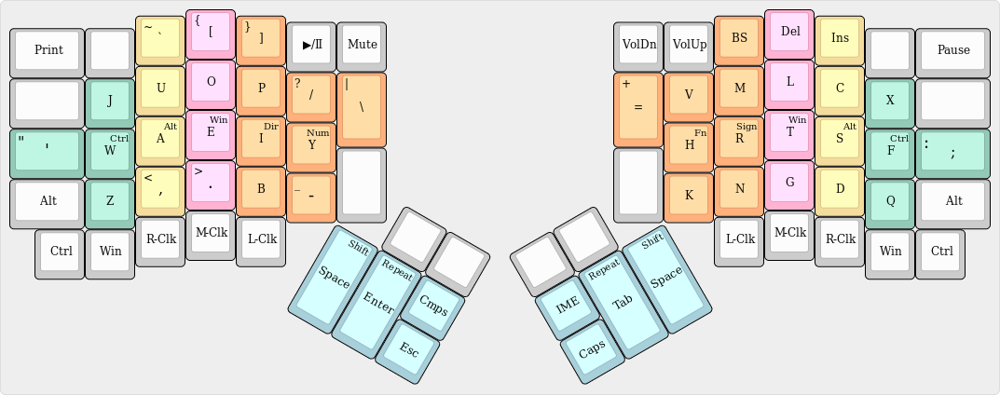
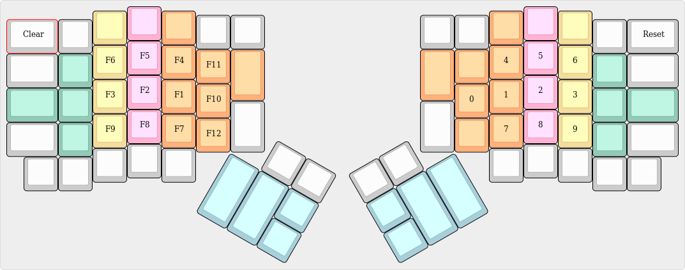
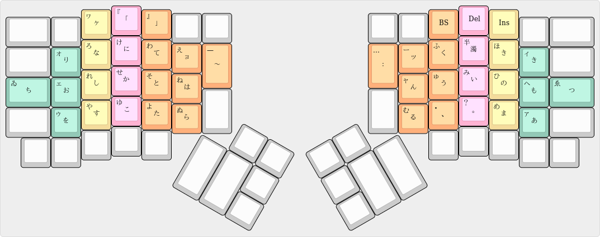

# Youhei配列
[English](README.md)|日本語

## Dir, Signレイヤー

## Num, Fnレイヤー

## 画像の説明
Clearキーは修飾キーとレイヤーの状態をまっさらにします。

Resetキーはキーボードの右上にあるリセットボタンとして使えます。リセットボタンはファームウェアを上書きするのに使います。間違えて押すと、キーボードが固まるので気をつけてください。固まったときは、ケーブルを抜き差しすると治ります。.

IMEキーは全角半角キーです。チルダとキーコードが被っているので変換キーに割り当てています。各自で変換キーをインプットメソッドの全角半角切り替えに設定してください。

CmpsキーはComposeキーの略です。

Repeatレイヤーは長押しでの連続入力をDual roleキーでも可能にします。反対の手で押してください。

## クリックキー
下段の両端にある修飾キーは、クリックキーとの同時押しを片手で出来るように用意されています。

反対の手でマウスなどのポインティングデバイスを操作できて便利です。

## [Composeキー](https://en.wikipedia.org/wiki/Compose_key)
R-Altキーに割り当てています。

[これ](https://github.com/h-youhei/myconfig/tree/master/etc/X11/xorg.conf.d/70-keyboard.conf)が設定ファイルです。

/etc/X11/xorg.conf.dに置いてください。 .

## 日本語入力
[ここ](https://github.com/h-youhei/myconfig/tree/master/init/mozc)に、設定ファイルがあります。mozcの設定ダイアログを開いて、インポートしてください。

keymap.txt には、変換や確定などの操作が定義されています。

kana-table.txt, gyoudan-table.txt には、それぞれかな入力、行段入力用のローマ字テーブルが定義されています。

### かな入力

ローマ字テーブルで実装している都合上、濁音・半濁音は前置キーとなります。

### 行段入力

左手で子音、右手で母音を入力します。子音、母音の順で入力してください。

や行、わ行も母音として扱っています。

子音をシフトまたは連続入力すると、子音の前に「っ」が追加されます。

母音をシフトすると、母音の後に「ん」が追加されます。

小文字キーを連続入力すると、「っ」単体を入力できます。

|あ|い|う|え|お|や|ゆ|いぇ|よ|わ|ゐ|ゑ|を|
|:---:|:---:|:---:|:---:|:---:|:---:|:---:|:---:|:---:|:---:|:---:|:---:|:---:|
|か|き|く|け|こ|きゃ|きゅ|きぇ|きょ|くぁ|くぃ|くぇ|くぉ|
|さ|し|す|せ|そ|しゃ|しゅ|しぇ|しょ|すぁ|すぃ|すぇ|すぉ|
|た|ち|つ|て|と|ちゃ|ちゅ|ちぇ|ちょ|つぁ|つぃ|つぇ|つぉ|
|な|に|ぬ|ね|の|にゃ|にゅ|にぇ|にょ|ぬぁ|ぬぃ|ぬぇ|ぬぉ|
|は|ひ|ふ|へ|ほ|ひゃ|ひゅ|ひぇ|ひょ|ふぁ|ふぃ|ふぇ|ふぉ|
|ま|み|む|め|も|みゃ|みゅ|みぇ|みょ|むぁ|むぃ|むぇ|むぉ|
|ら|り|る|れ|ろ|りゃ|りゅ|りぇ|りょ|るぁ|るぃ|るぇ|るぉ|
|が|ぎ|ぐ|げ|ご|ぎゃ|ぎゅ|ぎぇ|ぎょ|ぐぁ|ぐぃ|ぐぇ|ぐぉ|
|ざ|じ|ず|ぜ|ぞ|じゃ|じゅ|じぇ|じょ|ずぁ|ずぃ|ずぇ|ずぉ|
|だ|ぢ|づ|で|ど|ぢゃ|ぢゅ|ぢぇ|ぢょ|づぁ|づぃ|づぇ|づぉ|
|ば|び|ぶ|べ|ぼ|びゃ|びゅ|びぇ|びょ|ぶぁ|ぶぃ|ぶぇ|ぶぉ|
|ぱ|ぴ|ぷ|ぺ|ぽ|ぴゃ|ぴゅ|ぴぇ|びょ|ぷぁ|ぷぃ|ぷぇ|ぷぉ|
|た|てぃ|とぅ|て|と|てゃ|てゅ|てぇ|てょ|とぁ|とぃ|とぇ|とぉ|
|だ|でぃ|どぅ|で|ど|でゃ|でゅ|でぇ|でょ|どぁ|どぃ|どぇ|どぉ|
|ふぁ|ふぃ|ふ|ふぇ|ふぉ|ふゃ|ふゅ|ふぇ|ふょ|ほぁ|ほぃ|ほぇ|ほぉ|
|ゔぁ|ゔぃ|ゔ|ゔぇ|ゔぉ|ゔゃ|ゔゅ|ゔぇ|ゔょ|ぼぁ|ぼぃ|ぼぇ|ぼぉ|
|ぁ|ぃ|ぅ|ぇ|ぉ|ゃ|ゅ|ぇ|ょ|ゎ|うぃ|うぇ|うぉ|
