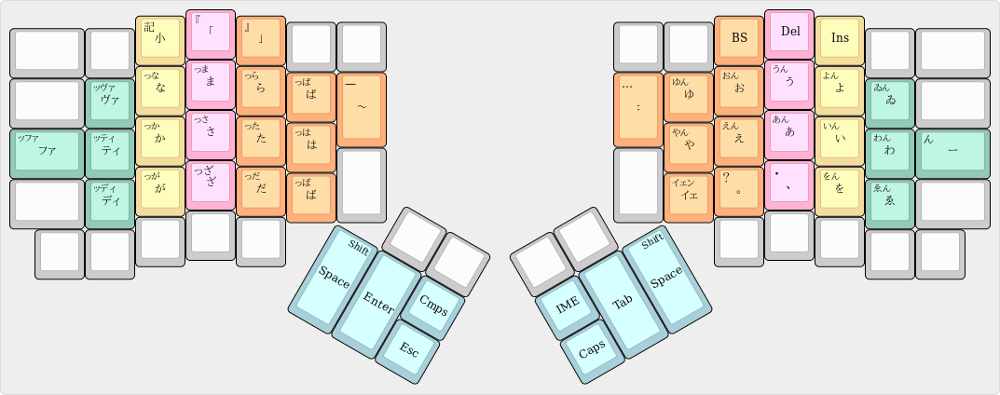

# Youhei配列
[English](README.md)|日本語

```
 ------------------------------                     ------------------------------
| Prnt | # | @ | ! | % | $ |   |                   |   | * | ( | ) | ^ | & |      |
|  Scr | 3 | 2 | 1 | 5 | 4 |   |                   |   | 8 | 9 | 0 | 6 | 7 |      |
|------------------------------|                   |------------------------------|
|      | Q | C | L | P | V | E |                   | I | K | G | U | Y | Z |      |
|      |   |   |   |   |   | s |                   | n |   |   |   |   |   |      |
|--------------------------| c |                   | s |--------------------------|
|   ?  | O | S | R | N | H |___|                   |___| D | T | E | I | A |  :   |
|   /  |   |   |   |   |   |   |                   |   |   |   |   |   |   |  ;   |
|--------------------------| B |                   | D |--------------------------|
|      | X | J | _ | F | B | S |                   | e | W | M | < | > | " |      |
|      |   |   | - |   |   |   | -------   ------- | l |   |   | , | . | ' |      |
------------------------------- | R | L | |Ba |For| ------------------------------
   |   |   | ~ | \ | + |        |Btn|Btn| | ck| wd|        | { | } |Pau|   |   |
   |   |Lck| ` | | | = |     -----------| |-----------     | [ | ] | se|Lck|   |
   |   |   |Win|Ctl|Alt|    |Sft|Fn | M | |   |Fn |Sft|    |Alt|Ctl|Win|   |   |
    -------------------     |   |   |Btn| |HP |   |   |     -------------------
                            | S | E |---| |---| T | S |
                            | p | n |Cap| |IME| a | p |
                            | c | t |Lck| |TGL| b | c |
                             -----------   -----------
```

## Fn layer

```
 ------------------------------                     ------------------------------
|      |   |   |   |   |   |   |                   |   |   |   |   |   |   |      |
|      |F3 |F2 |F1 |F5 |F4 |   |                   |   |F8 |F9 |F10|F6 |F7 |      |
|------------------------------|                   |------------------------------|
|      |   |   |   |   |   |   |                   |   |   |Le |Ri |   |   |      |
|      |   | 6 | 5 | 4 |   |   |                   |   |   |ft |ght|F11|F12|      |
|--------------------------|   |                   |   |--------------------------|
|      |   |   |   |   |   |___|                   |___|Ho |Do |   |   |   |      |
|      | . | 3 | 2 | 1 | 0 |   |                   |   |me |wn |Up |End|App|      |
|--------------------------|   |                   |   |--------------------------|
|      |   |   |   |   |   |   |                   |   |   |Pg |Pg |   |   |      |
|      |   | 9 | 8 | 7 |000|   | -------   ------- |   |   |Dn |Up |   |   |      |
------------------------------- |Vol|Vol| |   |   | ------------------------------
   |   |   |   |   |   |        | Dn| Up| |   |   |        |   |   |   |   |   |
   |   |   |   |   |   |     -----------| |-----------     |   |   |   |   |   |
   |   |   |Win|Ctl|Alt|    |Sft|Fn |Mu | |   |Fn |Sft|    |Alt|Ctl|Win|   |   |
    -------------------     |   |   | te| |   |   |   |     -------------------
                            | S | E |---| |---| T | S |
                            | p | n |   | |   | a | p |
                            | c | t |   | |   | b | c |
                             -----------   -----------
```

## 画像の説明
Resetキーはキーボードの右上にあるリセットボタンとして使えます。リセットボタンはファームウェアを上書きするのに使います。間違えて押すと、キーボードが固まるので気をつけてください。固まったときは、ケーブルを抜き差しすると治ります。.

IMEキーは全角半角キーです。チルダとキーコードが被っているので変換キーに割り当てています。各自で変換キーをインプットメソッドの全角半角切り替えに設定してください。

CmpsキーはComposeキーの略です。

Repeatレイヤーは長押しでの連続入力をDual roleキーでも可能にします。反対の手で押してください。

## クリックキー
反対の手でマウスなどのポインティングデバイスを操作できて便利です。

## [Composeキー](https://en.wikipedia.org/wiki/Compose_key)
Pauseキーに割り当てています。

[これ](https://github.com/h-youhei/myconfig/tree/master/etc/X11/xorg.conf.d/70-keyboard.conf)が設定ファイルです。

/etc/X11/xorg.conf.dに置いてください。

## 日本語入力
[ここ](https://github.com/h-youhei/myconfig/tree/master/init/mozc)に、設定ファイルがあります。mozcの設定ダイアログを開いて、インポートしてください。

keymap.txt には、変換や確定などの操作が定義されています。

kana-table.txt, gyoudan-table.txt には、それぞれかな入力、行段入力用のローマ字テーブルが定義されています。

### かな入力
```
 ----------------------------                     ----------------------------
|      |べ |ぞ |ざ |ぇ |ぶ |   |                   |   |ぢ |ぺ |ぐ |づ |ゎ |      |
|      | へ| そ| さ| え| ふ|   |                   |   | ち| れ| く| つ| わ|      |
|------------------------------|                   |------------------------------|
|      |ぼ |め |だ |ぱ |ぉ |   |                   |   |む |ぎ |ぬ |〜 |び | ぽ   |
|      | ほ| ま| た| ら| お|   |                   |   | も| き| の| っ| ひ|  ろ  |
|--------------------------|   |                   |   |--------------------------|
|  ぽ  |ば |げ |ど |で |ね |___|                   |___|み |じ |ぃ |・ |ぅ |      |
|   ろ | は| か| と| て| な|   |                   |   | に| し| い| ん| う|  ー  |
|--------------------------|   |                   |   |--------------------------|
|      |ぜ |げ |ぷ |ご |ぁ |   |                   |   |ぴ |ぷ |ず |： |！ | ）   |
|      | せ| け| る| こ| あ|   | -------   ------- |   | り| る| す| を| 、|  」  |
------------------------------- |   |   | |   |   | ------------------------------
   |   |   |   |   |   |        |   |   | |   |   |        |   |   |   |   |   |
   |   |   |Win|Ctl|Alt|     -----------| |-----------     |Alt|Ctl|Win|   |   |
    -------------------     |Sft|Fn |   | |   |Fn |Sft|     -------------------
                            |   |   |   | |   | C |   |
                            | S | E |---| |---| o | S |
                            | p | n |   | |   | n | p |
                            | c | t |   | |   | v | c |
                             -----------   -----------
```
シフトキー
大文字を小文字にする
あ行
小文字を大文字にする
や行
ぱ行にする
ら行
あ段をえ段にする
かけ、がげ、なね、まめ
お段をう段にする
のぬ、もむ
行をかえる
にみ、てへ、でべ
濁音にする
そのほかのか行、さ行、た行、は行

### 行段入力

左手で子音、右手で母音を入力します。子音、母音の順で入力してください。

や行、わ行も母音として扱っています。

子音をシフトまたは連続入力すると、子音の前に「っ」が追加されます。

母音をシフトすると、母音の後に「ん」が追加されます。

小文字キーを連続入力すると、「っ」単体を入力できます。

|あ|い|う|え|お|や|ゆ|いぇ|よ|わ|ゐ|ゑ|を|
|:---:|:---:|:---:|:---:|:---:|:---:|:---:|:---:|:---:|:---:|:---:|:---:|:---:|
|か|き|く|け|こ|きゃ|きゅ|きぇ|きょ|くぁ|くぃ|くぇ|くぉ|
|さ|し|す|せ|そ|しゃ|しゅ|しぇ|しょ|すぁ|すぃ|すぇ|すぉ|
|た|ち|つ|て|と|ちゃ|ちゅ|ちぇ|ちょ|つぁ|つぃ|つぇ|つぉ|
|な|に|ぬ|ね|の|にゃ|にゅ|にぇ|にょ|ぬぁ|ぬぃ|ぬぇ|ぬぉ|
|は|ひ|ふ|へ|ほ|ひゃ|ひゅ|ひぇ|ひょ|ふぁ|ふぃ|ふぇ|ふぉ|
|ま|み|む|め|も|みゃ|みゅ|みぇ|みょ|むぁ|むぃ|むぇ|むぉ|
|ら|り|る|れ|ろ|りゃ|りゅ|りぇ|りょ|るぁ|るぃ|るぇ|るぉ|
|が|ぎ|ぐ|げ|ご|ぎゃ|ぎゅ|ぎぇ|ぎょ|ぐぁ|ぐぃ|ぐぇ|ぐぉ|
|ざ|じ|ず|ぜ|ぞ|じゃ|じゅ|じぇ|じょ|ずぁ|ずぃ|ずぇ|ずぉ|
|だ|ぢ|づ|で|ど|ぢゃ|ぢゅ|ぢぇ|ぢょ|づぁ|づぃ|づぇ|づぉ|
|ば|び|ぶ|べ|ぼ|びゃ|びゅ|びぇ|びょ|ぶぁ|ぶぃ|ぶぇ|ぶぉ|
|ぱ|ぴ|ぷ|ぺ|ぽ|ぴゃ|ぴゅ|ぴぇ|びょ|ぷぁ|ぷぃ|ぷぇ|ぷぉ|
|た|てぃ|とぅ|て|と|てゃ|てゅ|てぇ|てょ|とぁ|とぃ|とぇ|とぉ|
|だ|でぃ|どぅ|で|ど|でゃ|でゅ|でぇ|でょ|どぁ|どぃ|どぇ|どぉ|
|ふぁ|ふぃ|ふ|ふぇ|ふぉ|ふゃ|ふゅ|ふぇ|ふょ|ほぁ|ほぃ|ほぇ|ほぉ|
|ゔぁ|ゔぃ|ゔ|ゔぇ|ゔぉ|ゔゃ|ゔゅ|ゔぇ|ゔょ|ぼぁ|ぼぃ|ぼぇ|ぼぉ|
|ぁ|ぃ|ぅ|ぇ|ぉ|ゃ|ゅ|ぇ|ょ|ゎ|うぃ|うぇ|うぉ|
