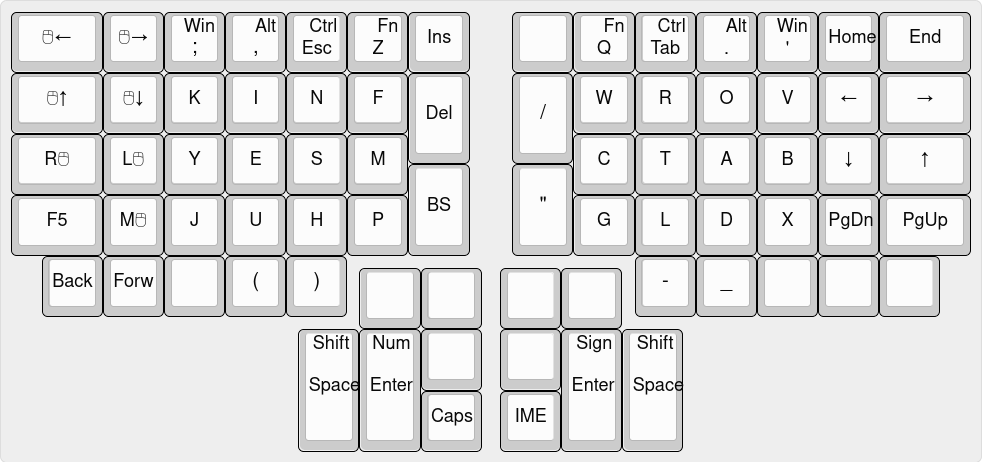

# qmk firmware用キーマップ
[English](README.md)|日本語

[ブログ記事][blog]により詳しく書いています。

## インストール
1. [qmk_firmware][qmk] をクローン
2. このリポジトリを `qmk_firmware/layouts/community/ergodox` にクローン
3. QMKのビルド環境を構築する([公式ドキュメント](https://docs.qmk.fm/#/ja/newbs_getting_started?id=set-up-your-environment))
4. ビルドしてキーボードに書き込む([公式ドキュメント](https://docs.qmk.fm/#/ja/newbs_building_firmware?id=build-your-firmware))

## 英語

## 数字、記号レイヤー

## Fnレイヤー

<!--
## [Composeキー](https://en.wikipedia.org/wiki/Compose_key)
Pauseキーに割り当てています。

[これ](https://github.com/h-youhei/myconfig/tree/master/etc/X11/xorg.conf.d/70-keyboard.conf)が設定ファイルです。

/etc/X11/xorg.conf.dに置いてください。
-->

## かな入力

単打で打てるようになっていないかなは、各キーの右上に書かれたカタカナを行段で組み合わせて入力します。\
濁音は右手の中指で行、人差し指でその隣のキーを同時に押します。\
外来音は左手の中指で段、人差し指でその隣のキーを同時に押します。\
ワ行は外来音と同じ要領で左手、段だけを押します。

| 単打 | 清音 | 濁音 | 外来音 | 外来濁音 |
|------|------|------|--------|----------|
|と    |ア・ヤ|ァ・ャ|ウァ    |          |
|か    |カ    |ガ    |クァ    |グァ      |
|し    |サ    |ザ    |スィ    |ズィ      |
|た    |タ    |ダ    |ツァ    |          |
|な    |ナ    |      |        |          |
|は    |ハ    |バ    |ファ    |ヴァ      |
|す    |パ    |      |        |          |
|に    |マ    |      |        |          |
|て    |ラ    |      |ティ    |ディ      |

[qmk]:https://github.com/qmk/qmk_firmware
[blog]:https://hkmtyh.com/computer/keyboard/layout/tyoki-chord/
