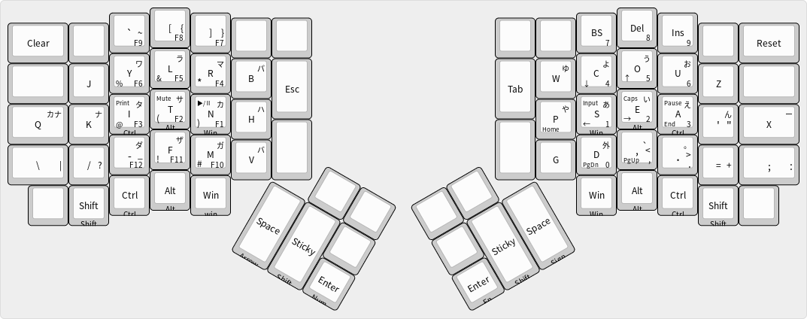

# Youhei's keymap

Center is of course no modifier or layer.

Center Right is shifted sign letter.

Bottom Left is Arrow or Sign layer pressed with different hand.

Top Left is Arrow or Sign layer pressed with same hand.

Bottom Right is Number or Function layer pressed with different hand.

Top Right is Japanese consonants and vowels for '行段入力'.

Clear key resets modifier or layer states.

Reset key can be used instead of reset button. It's not assigned in default layer to avoid freeze when to miss-press. Use it with any layer key.

Input key is used for toggle Input Method. Internally, it's assigned to Kana key.

Sticky key is oneshot shift modifier.

## Japanese Input 日本語入力
左手で子音、右手で母音を入力します。子音、母音の順で入力してください。

ヤ行は母音として扱っています。例えば、「や」はそのまま「や」、「カや」は「きゃ」となります。

「カナ」はカタカナへの変換及び、ひらがなモードとカタカナモードの切り替えに使用します。

「外」は外来音及び小文字の入力に使用する前置キーです。例えば、「外あ」は「ぁ」、「外カあ」は「くぁ」となります。

||ア段|イ段|ウ段|エ段|オ段|ヤ段|ユ段|ヨ段|
|:---:|:---:|:---:|:---:|:---:|:---:|:---:|:---:|
|**母音**|ァ|ィ|ゥ|ェ|ォ|ャ|ュ|ョ|
|**カ行**|クァ|クィ||クェ|クォ||||
|**サ行**||||シェ|||||
|**タ行**|ツァ|ティ|トゥ|チェ|ツォ||テュ||
|**ハ行**|ファ|フィ||フェ|フォ||フュ||
|**ワ行**|ヮ|ウィ||ウェ|ウォ||||
|**ガ行**|グァ|グィ||グェ|グォ||||
|**ザ行**||||ジェ|||||
|**ダ行**||ディ|ドゥ|ヂェ|||デュ||
|**バ行**|ヴァ|ヴィ|ヴ|ヴェ|ヴォ||ヴュ||

## Input Method Configuration
Under 'im' directory, there are config files I use. You can use it.

supported
- libskk

## Issue
Mozc doesn't allow to assign 'convert to katakana' etc to alphanumeric letter. So I have to offer some way to 'convert to katakana'.

