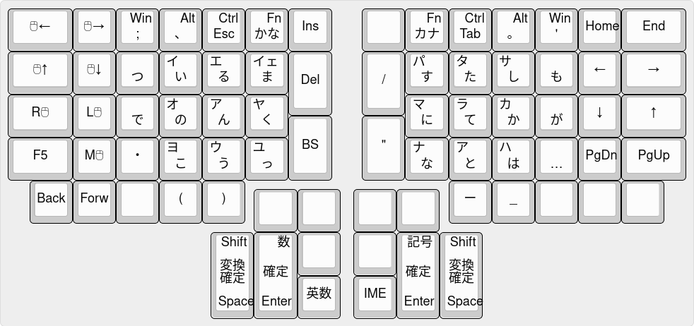
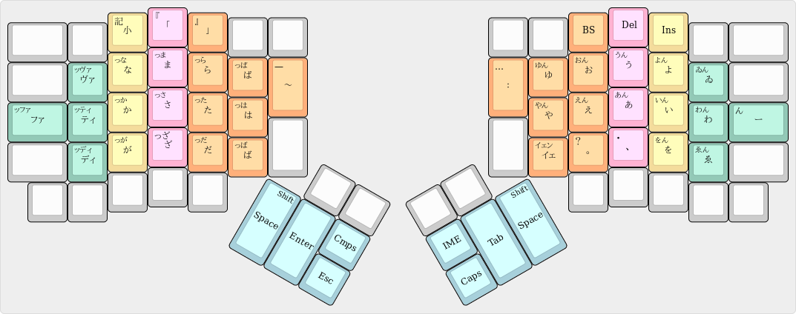

# Youhei's keymap

Each key legend on

- Center is of course no modifier or layer.

- Top Left is shifted sign letter.

- Bottom Left is Arrow or Sign layer when be pressed with different hand.

- Bottom Right is Number or Function layer when be pressed with different hand.

- Top Right is modifier or layer when be holded.

- Bottom Center is any layer.

Clear key resets modifier or layer states.

Reset key can be used instead of reset button. The key is used for overwrite firmware. If you pressed the key, the keyboard is freezed. When it happned, plug out the cable then plug it in.

IM key is used for toggle Input Method. Internally, it's assigned to Henkan key.

Cmps key is Compose key. Internaly, it's assigned to R-Alt key.

## Compose key
[This](https://github/h-youhei/myconfig/tree/master/etc/X11/xorg.conf.70-keyboard.conf) is the config file.

Put it in /etc/X11/xorg.conf.d .

## Japanese Input 日本語入力
[ここ](https://github/h-youhei/myconfig/tree/master/init/mozc)に、設定ファイルがあります。mozcの設定ダイアログを開いて、インポートしてください。

keymap.txt には、変換や確定などの操作が定義されています。

kana-table.txt, gyoudan-table.txt には、それぞれかな入力、行段入力用のローマ字テーブルが定義されています。

### かな入力

ローマ字テーブルで実装している都合上、濁音・半濁音は、前置キーとなります。

### 行段入力

左手で子音、右手で母音を入力します。子音、母音の順で入力してください。

や行、わ行も母音として扱っています。

子音をシフトまたは連続入力すると、子音の前に「っ」が追加されます。

母音をシフトすると、母音の後に「ん」が追加されます。

小文字キーをシフトすると「ん」が、連続入力すると「っ」が入力できます。

|あ|い|う|え|お|や|ゆ|いぇ|よ|わ|ゐ|ゑ|を|
|:---:|:---:|:---:|:---:|:---:|:---:|:---:|:---:|:---:|:---:|:---:|:---:|:---:|
|か|き|く|け|こ|きゃ|きゅ|きぇ|きょ|くぁ|くぃ|くぇ|くぉ|
|さ|し|す|せ|そ|しゃ|しゅ|しぇ|しょ|すぁ|すぃ|すぇ|すぉ|
|た|ち|つ|て|と|ちゃ|ちゅ|ちぇ|ちょ|つぁ|つぃ|つぇ|つぉ|
|な|に|ぬ|ね|の|にゃ|にゅ|にぇ|にょ|ぬぁ|ぬぃ|ぬぇ|ぬぉ|
|は|ひ|ふ|へ|ほ|ひゃ|ひゅ|ひぇ|ひょ|ふぁ|ふぃ|ふぇ|ふぉ|
|ま|み|む|め|も|みゃ|みゅ|みぇ|みょ|むぁ|むぃ|むぇ|むぉ|
|ら|り|る|れ|ろ|りゃ|りゅ|りぇ|りょ|るぁ|るぃ|るぇ|るぉ|
|が|ぎ|ぐ|げ|ご|ぎゃ|ぎゅ|ぎぇ|ぎょ|ぐぁ|ぐぃ|ぐぇ|ぐぉ|
|ざ|じ|ず|ぜ|ぞ|じゃ|じゅ|じぇ|じょ|ずぁ|ずぃ|ずぇ|ずぉ|
|だ|ぢ|づ|で|ど|ぢゃ|ぢゅ|ぢぇ|ぢょ|づぁ|づぃ|づぇ|づぉ|
|ば|び|ぶ|べ|ぼ|びゃ|びゅ|びぇ|びょ|ぶぁ|ぶぃ|ぶぇ|ぶぉ|
|ぱ|ぴ|ぷ|ぺ|ぽ|ぴゃ|ぴゅ|ぴぇ|びょ|ぷぁ|ぷぃ|ぷぇ|ぷぉ|
|た|てぃ|とぅ|て|と|てゃ|てゅ|てぇ|てょ|つぁ|つぃ|つぇ|つぉ|
|だ|でぃ|どぅ|で|ど|でゃ|でゅ|でぇ|でょ|づぁ|づぃ|づぇ|づぉ|
|ふぁ|ふぃ|ふ|ふぇ|ふぉ|ふゃ|ふゅ|ふぇ|ふょ|ふぁ|ふぃ|ふぇ|ふぉ|
|ゔぁ|ゔぃ|ゔ|ゔぇ|ゔぉ|ゔゃ|ゔゅ|ゔぇ|ゔょ|ゔぁ|ゔぃ|ゔぇ|ゔぉ|
|ぁ|ぃ|ぅ|ぇ|ぉ|ゃ|ゅ|ぇ|ょ|ゎ|うぃ|うぇ|うぉ|
