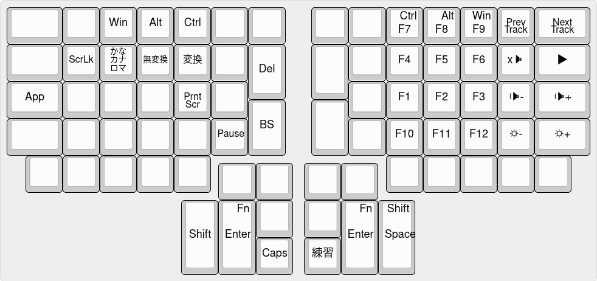

# Youhei's keymap
English|[日本語](README.ja.md)

## Install
1. clone [qmk_firmware][qmk]
2. clone this repository in `qmk_firmware/layouts/community/ergodox`
3. run `sh write.sh`

## Base

<!--
```
 ------------------------------                     ------------------------------
| Prnt | $ | % | ! | @ | # |   |                   | { | * | ( | ) | ^ | & |Clear |
|  Scr | 4 | 5 | 1 | 2 | 3 |Ins|                   | { | 8 | 9 | 0 | 6 | 7 |      |
|      | Fn|Win|Alt|Ctl|   |   |                   |   |   |Ctl|Alt|Win|Fn |      |
|------------------------------|                   |------------------------------|
|   |  | Q | V | R | N | B | + |                   | } | > | U | O | _ | " |  ~   |
|   \  |   |   |   |   |   | = |                   | ] | . |   |   | - | ' |  `   |
|--------------------------|   |                   |   |--------------------------|
|   ?  | W | F | T | S | L |___|                   |___| < | I | A | P | G |  :   |
|   /  |   |   |   |   |   |   |                   |   | , |   |   |   |   |  ;   |
|--------------------------|BS |                   |Del|--------------------------|
| Caps | J | X | C | H | M |   |                   |   | Y | E | D | K | Z | Caps |
|      |   |   |   |   |   |   | -------   ------- |   |   |   |   |   |   |      |
------------------------------- | R | L | |Pg |Pg | ------------------------------
   |   |   |Ho |Up |Dn |        |Btn|Btn| | Dn| Up|        |Le |Ri |End|   |   |
   |   |   | me|   |   |     -----------| |-----------     | ft|ght|   |   |   |
    -------------------     |Sft|   | M | |Ba |   |Sft|     -------------------
                            |   |   |Btn| | ck|   |   |
                            | S | E |---| |---| T | S |
                            | p | n |Esc| |IME| a | p |
                            | c | t |   | |TGL| b | c |
                             -----------   -----------
```
-->

## Fn layer

<!--
```
 ------------------------------                     ------------------------------
|      |   |   |   |   |   |   |                   |   |   |   |   |   |   |      |
|      |F4 |F5 |F1 |F2 |F3 |   |                   |   |F8 |F9 |F10|F6 |F7 |      |
|------------------------------|                   |------------------------------|
|      |   |   |   |   |   |   |                   |   |   |   |   |   |   |      |
|      |   |   |F11|F12|   |   |                   |   |   |   |   |   |   |      |
|--------------------------|   |                   |   |--------------------------|
|      |   |Mu |Vol|Vol|Ply|___|                   |___|   |   |Scr|Pau|   |      |
|      |   | te| Dn| Up|Stp|   |                   |   |   |App|Lck| se|   |      |
|--------------------------|   |                   |   |--------------------------|
|      |   |   |   |   |   |   |                   |   |   |   |   |   |   |      |
|      |   |   |   |   |   |   | -------   ------- |   |   |   |   |   |   |      |
------------------------------- |   |   | |   |   | ------------------------------
   |   |   |   |   |   |        |   |   | |   |   |        |   |   |   |   |   |
   |   |   |   |   |   |     -----------| |-----------     |   |   |   |   |   |
   |   |   |Win|Ctl|Alt|    |Sft|   |   | |   |   |Sft|    |Alt|Ctl|Win|   |   |
    -------------------     |   |   |   | |   |   |   |     -------------------
                            | S | E |---| |---| T | S |
                            | p | n |   | |   | a | p |
                            | c | t |   | |   | b | c |
                             -----------   -----------
```
-->
<!--
## Simultaneous Modifier
simultaneous tapping version of MOD-TAP.

Key press is treated as simultaneous tapping
when satisfy both condition below.

- difference of pressed time is within the term defined (`SIMULTANEOUS_WAIT_TERM`)
- overlapping time the keys are held is over the term defined (`SIMULTANEOUSING_TERM`)

To use it,<br>
1. copy `process_simultaneous.c/h` and `util_user.c/h`, and append it to SRC in your `rules.mk`
2. include `process_simultaneous.h` to your `keymap.c`
3. call `process_simultaneous()` from `process_record_user()`
4. call `matrix_scan_simultaneous()` from `matrix_scan_user()`

and edit `qmk_firmware/tmk_core/common/action.h`
```
typedef struct {
	...
	bool simultaneous;
} keyrecord_t;
```

or if you don't need to change behavior in `process_record_user`,
depending on wether it is simultaneous tapping or not,
remove following code in `(un)register_simultaneous()` in `process_simultaneous.c`
```
process_record(...
	...,
	.simultaneous = true
	...
```

To customize, read process_simultaneous.h .
-->

## details
IME key is used for toggle Input Method. Internally, it's assigned to KANA key.

## Japanese Input
see [Japanese Readme](README.ja.md)

[qmk]: https://github.com/qmk/qmk_firmware
